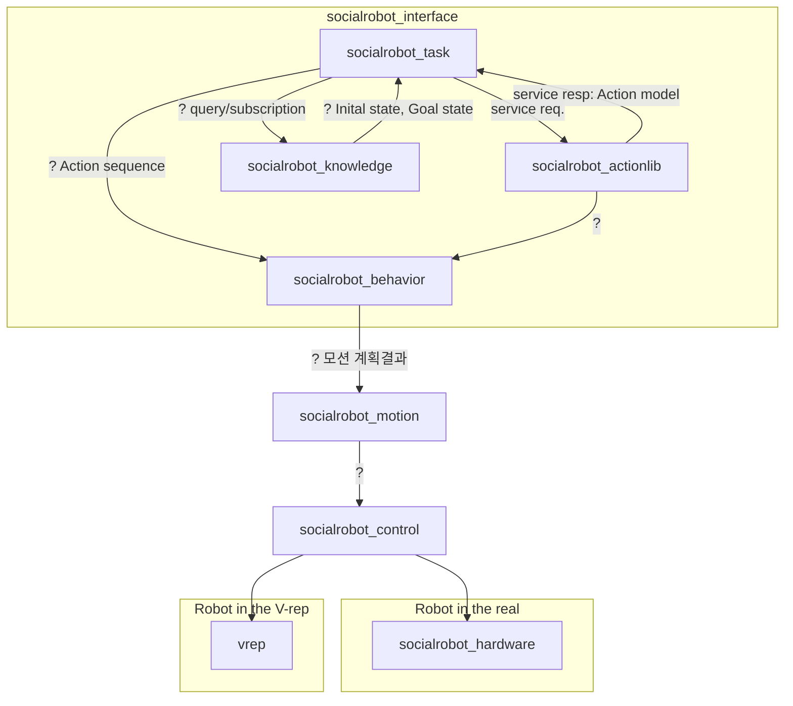

# Social Robot Project Group

<!-- Variables -->

- Version 1.0.0

---

**Package summary**

소셜로봇 프로젝트의 통합 repository입니다. 통합 빌드, 테스트 및 배포 용도로 사용됩니다.

**Table of Contents**
- [Social Robot Project Group](#social-robot-project-group)
  - [Overview](#overview)
  - [Installation methods](#installation-methods)
    - [Install manually](#install-manually)
      - [1. ROS](#1-ros)
      - [2. 추가 ROS 패키지 설치](#2-추가-ros-패키지-설치)
      - [3. GRASPIT](#3-graspit)
      - [4. GraspIt ROS](#4-graspit-ros)
      - [5. Social robot ROS 패키지 설치](#5-social-robot-ros-패키지-설치)
      - [6. V-REP](#6-v-rep)
  - [Dependencies](#dependencies)
    - [Frameworks](#frameworks)
    - [Third-party libraries](#third-party-libraries)
  - [Quick start (Simualtion Demo)](#quick-start-simualtion-demo)

---

## Overview

[](http://www.ros.org/)

- 소셜로봇 프로젝트의 통합 repository입니다. 통합 빌드, 테스트 및 배포 용도로 사용됩니다.
- Integration test를 통과한 버전만 배포합니다.
- 개별 모듈의 개발은 해당 repository의 devel branch에서 부탁드립니다.



## Installation methods

### Install manually

ROS 및 GraspIt이 사전에 설치되어 있어야 합니다.

#### 1. ROS

ros-kinetic 및 ros-melodic 버전에서 테스트 되었습니다.

다음 링크에서 자세한 설치 방법을 확인할 수 있습니다. 
[ROS Install](http://wiki.ros.org/melodic/Installation/Ubuntu)

#### 2. 추가 ROS 패키지 설치

```bash
apt install ros-$ROS_DISTRO-vision-msgs ros-$ROS_DISTRO-moveit
apt install ros-$ROS_DISTRO-navigation ros-$ROS_DISTRO-rosjava
apt install flex ros-$ROS_DISTRO-move-base-msgs ros-$ROS_DISTRO-nav-msgs ros-$ROS_DISTRO-tf2-bullet freeglut3-dev ros-$ROS_DISTRO-mongodb-store
```

ROSPLAN을 위해서는 아래 패키지가 필요함.
```
apt install ros-kinetic-navigation ros-kinetic-rosjava
apt install flex ros-kinetic-move-base-msgs ros-kinetic-nav-msgs ros-kinetic-tf2-bullet freeglut3-dev ros-kinetic-mongodb-store
```

#### 3. GRASPIT

의존 패키지 설치
```
sudo apt install libqt4-dev libqt4-opengl-dev libqt4-sql-psql libcoin80-dev libsoqt4-dev libblas-dev liblapack-dev libqhull-dev libeigen3-dev
```

graspit 소스 clone
```bash
git clone https://github.com/graspit-simulator/graspit.git
```

빌드 & 설치
```
cd graspit
mkdir build
cd build
cmake ..
make -j5
sudo make install
```

bash를 사용한다면 ~/.bashrc 파일 안에 아래 명령어를 추가하면 됩니다. (zsh을 사용하면 ~/.zshrc)
```
export LD_LIBRARY_PATH=/usr/local/lib:$LD_LIBRARY_PATH
export GRASPIT=~/.graspit
```

설정을 적용하기 위해 아래 명령어를 실행합니다.
```
source ~/.bashrc
```

#### 4. GraspIt ROS

GraspIt을 설치한 후에 ROS에서 쓸 수 있도록 [인터페이스](https://github.com/graspit-simulator/graspit_interface#ros-setup)를 추가해야 합니다.


```
//clone packages into catkin workspace
git clone https://github.com/graspit-simulator/graspit_interface.git
git clone https://github.com/graspit-simulator/graspit_commander.git

//build workspace
catkin_make
```

#### 5. Social robot ROS 패키지 설치

소셜로봇 프로젝트는 다음의 ROS 패키지들을 필요로합니다.

- socialrobot_actionlib
- socialrobot_behavior
- socialrobot_hardware
- socialrobot_interface
- socialrobot_knowledge
- socialrobot_motion
- socialrobot_perception
- socialrobot_reasoner
- socialrobot_task

#### 6. V-REP

socialrobot 프로젝트는 CoppeliaSim(구 v-rep) 시뮬레이터를 사용합니다.(version 4.0.0 이상)
시뮬레이션 모델들은 [Vortex engine](https://www.coppeliarobotics.com/helpFiles/en/dynamicsModule.htm) 라이센스를 필요로합니다.
[CM-labs](https://www.cm-labs.com/vortex-studio/)에서 가입 후 비상업용 라이센스를 발급받을 수 있습니다.


다운로드: [CoppeliaSim Linux](http://www.coppeliarobotics.com/downloads.html)

압축 해제
```
tar -xvzf {file_name}
```

실행
```
cd {v-rep directory path}
./vrep.sh
```

ROS와 연동하기 위해 socialrobot 프로젝트는 remote api를 사용합니다. 활성화하기 위해 vrep 디렉토리 안의 *remoteApiConnections.txt* 파일을 수정합니다.
```
portIndex1_port             = 19997
```

## Dependencies

### Frameworks

- ROS Kinetic/Melodic

### Third-party libraries

TBA

## Quick start (Simualtion Demo)

1. `roscore` 실행
2. V-REP 실행
    1. vrep remote api로 시뮬레이션이 진행되므로, roscore가 먼저 실행되어야함
3. `sudo service mongodb stop`
4. 데모에 필요한 모듈들을 roslaunch로 실행
    ```
    roslaunch socialrobot_interface init.launch
    ```

    로봇 하드웨어는 SKKUrobot과 RobocareRobot 2가지가 있으며 robot_name 파라미터로 변경가능
    ```
    # SKKURobot
    roslaunch socialrobot_state demo_init.launch robot_name:=skkurobot

    # RobocareRobot
    roslaunch socialrobot_state demo_init.launch robot_name:=social_robot
    ```
5. Task수행을 위한 State machine 실행
    ```
    rosrun socialrobot_interface demo.launch
    ```
6. Service 명령어를 이용한 데모 작업 요청
    '''
	rosservice call /socialrobot/set_command 'default' '{}'
    '''
