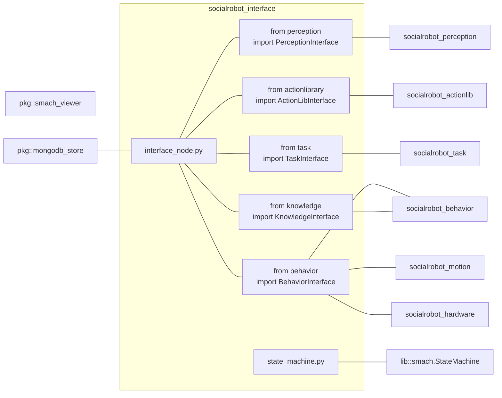

# socialrobot_interface

<!-- Variables -->
[SRP_main]: https://gitlab.com/social-robot/socialrobot

- Version 1.0.0
- [[Go to the Social Robot Project Main]][SRP_main]

---

<div style="display:flex;">
<div style="flex:50%; padding-right:10px; border-right: 1px solid #dcdde1">

**Package summary**

This module provides a facade object that runs the entire social robot system.

- Maintainer status: maintained
- Maintainers
  - Jeongmin Jeon (nicky707@daum.net)
  - Hong-ryul Jung (jung.hr.1206@gmail.com)
  - Hyungpil Moon (hyungpil@skku.edu)
- Author
  - Jeongmin Jeon (nicky707@daum.net)
- License: {License Name}
- Source: git https://gitlab.com/social-robot/socialrobot_interface.git

</div>
<div style="flex:40%; padding-left:10px;">

**Table of Contents**
- [socialrobot_interface](#socialrobot_interface)
  - [Overview](#overview)
  - [Installation methods](#installation-methods)
    - [Install manually](#install-manually)
  - [Dependencies](#dependencies)
    - [Frameworks](#frameworks)
    - [Third-party libraries](#third-party-libraries)
    - [Social Robot Project Modules](#social-robot-project-modules)
    - [Hardware requirements](#hardware-requirements)
  - [Quick start](#quick-start)
  - [Launch Parameters](#launch-parameters)
  - [Nodes](#nodes)
    - [socialrobot_interface](#socialrobot_interface-1)

</div>
</div>

---

## Overview

This module provides a facade object that runs the entire social robot system.



## Installation methods

### Install manually

1. Install the ROS. [Instructions for Ubuntu 16.04](http://wiki.ros.org/indigo/Installation/Ubuntu)
2. [Setup your ROS environment](http://wiki.ros.org/ROS/Tutorials/InstallingandConfiguringROSEnvironment)
3. Install mongoDB for ROS
  ```
  sudo apt-get install ros-kinetic-mongodb-* ros-kinetic-smach*
  ```

## Dependencies

### Frameworks

- ROS Kinetic/Melodic

### Third-party libraries

- smach_ros
- smach_viewer
- mongoDB 

### Social Robot Project Modules

- socialrobot_perception
- socialrobot_actionlib
- socialrobot_task
- socialrobot_behavior
- socialrobot_knowledge
- socialrobot_motion
- socialrobot_hardware

### Hardware requirements

This package does not require any hardware device.

## Quick start 

Module initialize launching

- Initialization
    - [init.launch](./launch/init.launch)


## Launch Parameters

- robot_name (string, default: social_robot)
  - set robot description name.
- use_rviz (string, default: true)
  - open rviz visualizer
- sim (string, default: false)
  - set simulation mode
- sim_env (string, default: default)
  - if `sim` is true, setup V-rep scene file name
- use_mongodb (string, default: false)
  - use data base ROS package
- use_state_viewer (string, default: false)
  - open state machine graph vizualizer
- object_tracking (string, default: false)
  - If perception module can track the objects, set `true`

## Nodes

### socialrobot_interface

#### Services

- /socialrobot/set_command ([socialrobot_interface/SetCommand](./srv/SetCommand.srv))
  - request action sequence as a result of task planning

<div style="display:flex; padding-left:50px">
<div style="flex:50%; padding-right:10px; border-right: 1px solid #dcdde1">

Request

- command (`string`)
  - set 'GET' or 'SET'
- problem (`socialrobot_actionlib/Problem`)
  - request task to execute PDDL problem
</div>
<div style="flex:50%; padding-left:10px;">

Response

- result (`bool`)
  - result of object manipulation
- error (`string`)
  - error messages
- action_sequence (`string[]`)
  - task plan result

</div>
</div>

- /socialrobot/set_goal_predicate ([socialrobot_interface/SetGoalPredicate](./srv/SetGoalPredicate.srv))
  - request task for goal predicates

<div style="display:flex; padding-left:50px">
<div style="flex:50%; padding-right:10px; border-right: 1px solid #dcdde1">

Request

- goal_predicates (`socialrobot_actionlib/Predicate[]`)
  - goal PDDL predicates
- target_object (`string`)
  - name of target object for manipulation [optional]
</div>
<div style="flex:50%; padding-left:10px;">

Response

- result (`int32`)
  - SUCCESS = 1
  - FAIL = 0

</div>
</div>

---

- [[Go to the Social Robot Project Main]][SRP_main]
