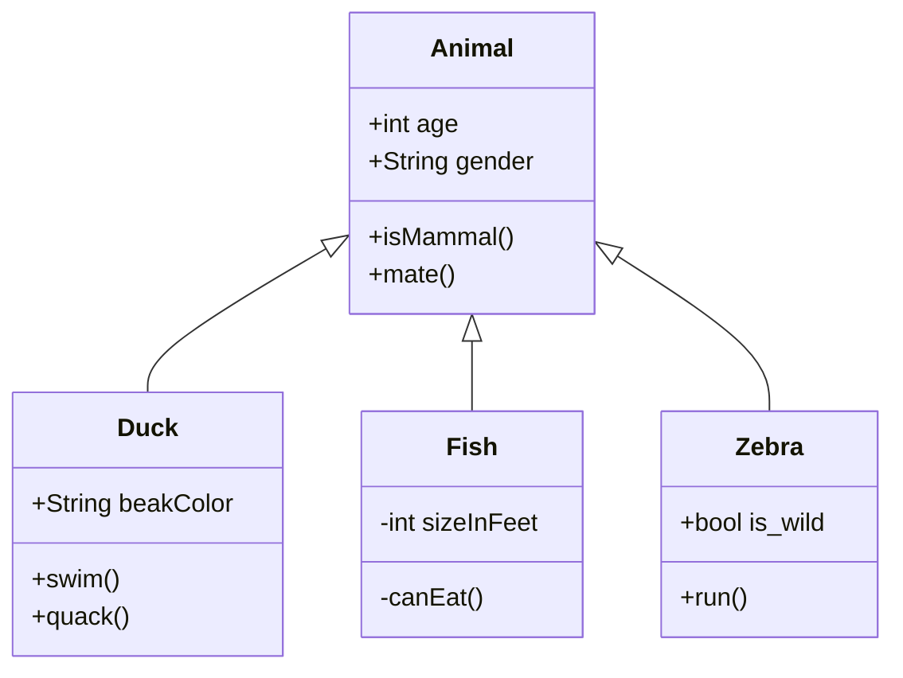

# socialrobot_motion 

<!-- Variables -->
[SRP_main]: https://gitlab.com/social-robot/socialrobot

- Version 1.0.0
- [[Go to the Social Robot Project Main]][SRP_main]

---

<div style="display:flex;">
<div style="flex:50%; padding-right:10px; border-right: 1px solid #dcdde1">

**Package summary**

Lorem ipsum dolor sit amet, consectetur adipisicing elit, sed do eiusmod tempor incididunt ut labore et dolore magna aliqua. Ut enim ad minim veniam, quis nostrud exercitation ullamco laboris nisi ut aliquip ex ea commodo consequat. Duis aute irure dolor in reprehenderit in voluptate velit esse cillum dolore eu fugiat nulla pariatur. Excepteur sint occaecat cupidatat non proident, sunt in culpa qui officia deserunt mollit anim id est laborum.

- Maintainer status: maintained
- Maintainers
  - John Doe (john1@organization.com)
  - John Doe (john2@organization.com)
  - John Doe (john3@organization.com)
- Author
  - John Doe (john0@organization.com)
- License: {License Name}
- Source: git https://gitlab.com/social-robot/socialrobot_motion.git

</div>
<div style="flex:40%; padding-left:10px;">

**Table of Contents**
1. [Overview](#overview)
2. [Installation methods](#installation-methods)
   1. [Install manually](#install-manually)
3. [Features](#features)
   1. [arm_planner](#arm_planner)
   2. [grasp_planner](#grasp_planner)

</div>
</div>

---

## Overview

Lorem ipsum dolor sit amet, consectetur adipisicing elit, sed do eiusmod tempor incididunt ut labore et dolore magna aliqua.



## Installation methods

### Install manually

1. Install the ROS. [Instructions for Ubuntu 16.04](http://wiki.ros.org/indigo/Installation/Ubuntu)
2. [Setup your ROS environment](http://wiki.ros.org/ROS/Tutorials/InstallingandConfiguringROSEnvironment)
3. Install vision_msgs ROS package
   ```
   sudo apt-get install ros-kinetic-vision-msgs
   ```   
4. Install moveit ROS package
   ```
   sudo apt-get install ros-kinetic-moveit
   ```
5. Install graspit and dependencies
   ```
   sudo apt install libqt4-dev libqt4-opengl-dev libqt4-sql-psql libcoin80-dev libsoqt4-dev libblas-dev liblapack-dev libqhull-dev libeigen3-dev
   ```

   clone graspit source 

   ```bash
   git clone https://github.com/graspit-simulator/graspit.git
   ```

   make & install

   ```
   cd graspit
   mkdir build
   cd build
   cmake ..
   make -j5
   sudo make install
   ```

   add environment variable to ~/.bashrc (or zshrc)

   ```
   export LD_LIBRARY_PATH=/usr/local/lib:$LD_LIBRARY_PATH
   export GRASPIT=~/.graspit
   ```
6. Install graspit ROS packages
   ```
   //move to ROS workspace path
   cd <WORKSPACE_DIR>/src
   
   //clone packages
   git clone https://github.com/graspit-simulator/graspit_interface.git
   git clone https://github.com/graspit-simulator/graspit_commander.git

   //build workspace
   cd graspit_ros_ws
   catkin_make
   ```

## Features

### arm_planner

Object mesh file path : ../socialrobot_motion/mesh/moveit/

1. Caculate manipulability
   - targetPose에서의 maipulability를 구함
      - Input : targetBody, find_manipulability, goalType, targetPose
      - Output : planResult, manipulability
2. Update scene, detach & attach objects
   - 물체의 상태나 환경을 업데이트
      - Input : targetBody, obstacle_ids, obstacles, targetObject
3. Compute path
   - 정해진 위치 또는 각도로 움직이기 위한 joint trajectory 생성
      - Input : targetBody, obstacle_ids, obstacles, goalType, targetPose or targetJointState, currentJointState(default :current joint state in moveit!)
      - Output : planResult, jointTrajectory

`예제`

```
from socialrobot_motion.srv import *

def main():
   srv_arm_plan = rospy.ServiceProxy('/motion_plan/move_arm', MotionPlan)

   arm_req = MotionPlanRequest()

   // set input value
   arm_req.targetBody = MotionPlanRequest.LEFT_ARM
   arm_req.obstacle_ids = <obstacle_ids>
   arm_req.obstacles = <obstacles>
   arm_req.goalType = MotionPlanRequest.CARTESIAN_SPACE_GOAL
   arm_req.targetPose = <targetPose>
   arm_req.currentJointState = <currentJointState>
   
   Result = srv_arm_plan(arm_req)
```

### grasp_planner

- Gripper model
   - name : robot_name + "_left", "_right"
   - path : ../.graspit/models/robots/
   - 필요한 gripper model은 [[Robocare 패키지에서 social_robot_description/graspit_model]](https://gitlab.com/social-robot/robocare/-/tree/master/social_robot_arm/social_robot_description/graspit_model)로 들어가면 찾을 수 있다.
- Object model
   - path : ../socialrobot_motion/mesh/graspit/
   - 기존 물체 목록: [socialrobot_commons/object_dataset/object_lists.md](https://gitlab.com/social-robot/socialrobot_commons/-/blob/master/object_dataset/object_lists.md)
- Input value
   - targetBody, obstacle_ids, obstacles, targetObject, gripper_pose(default :current gripper pose in moveit!)
- Output value
   - planResult, endEffectorPose, graspQuality, dofs

`예제`

```
from socialrobot_motion.srv import *

def main():
   srv_grasp_plan = rospy.ServiceProxy('/motion_plan/grasp_plan', MotionPlan)

   grasp_req = MotionPlanRequest()

   // set input value
   grasp_req.targetBody = MotionPlanRequest.LEFT_GRIPPER
   grasp_req.obstacle_ids = <obstacle_ids>
   grasp_req.obstacles = <obstacles>
   grasp_req.targetObject = <targetObject>
   grasp_req.gripper_pose = <gripper_pose>

   Result = srv_grasp_plan(grasp_req)
```

---

- [[Go to the Social Robot Project Main]][SRP_main]
