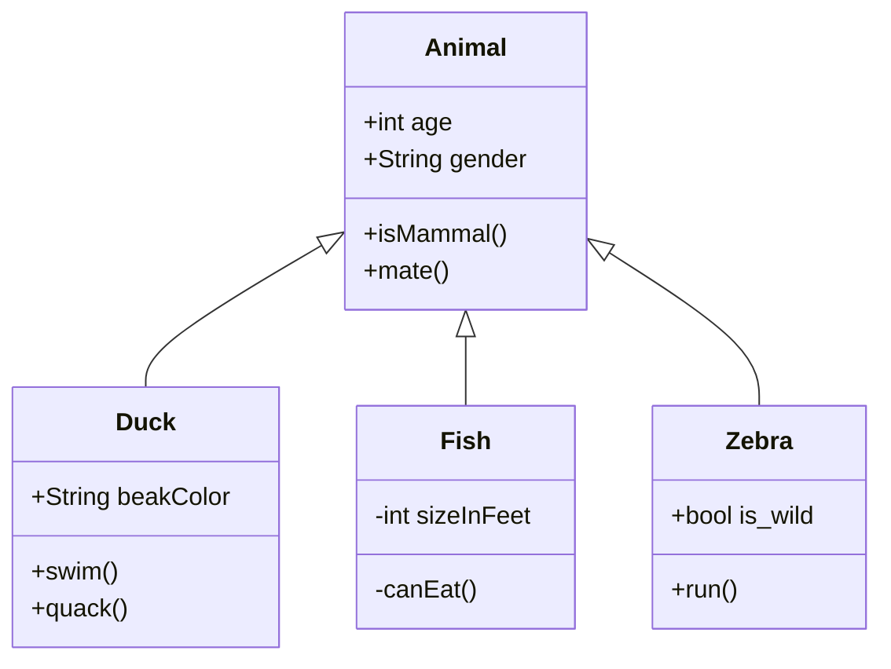

# socialrobot_perception

<!-- Variables -->
[SRP_main]: https://gitlab.com/social-robot/socialrobot

- Version 1.0.0
- [[Go to the Social Robot Project Main]][SRP_main]

---

<div style="display:flex;">
<div style="flex:50%; padding-right:10px; border-right: 1px solid #dcdde1">

**Package summary**

Lorem ipsum dolor sit amet, consectetur adipisicing elit, sed do eiusmod tempor incididunt ut labore et dolore magna aliqua. Ut enim ad minim veniam, quis nostrud exercitation ullamco laboris nisi ut aliquip ex ea commodo consequat. Duis aute irure dolor in reprehenderit in voluptate velit esse cillum dolore eu fugiat nulla pariatur. Excepteur sint occaecat cupidatat non proident, sunt in culpa qui officia deserunt mollit anim id est laborum.

- Maintainer status: maintained
- Maintainers
  - John Doe (john1@organization.com)
  - John Doe (john2@organization.com)
  - John Doe (john3@organization.com)
- Author
  - John Doe (john0@organization.com)
- License: {License Name}
- Source: git https://{Git URL}.git

</div>
<div style="flex:40%; padding-left:10px;">

**Table of Contents**
1. [Overview](#overview)
2. [Installation methods](#installation-methods)
   1. [Install using the convenience script](#install-using-the-convenience-script)
   2. [Install using the Docker images](#install-using-the-docker-images)
   3. [Install manually](#install-manually)
3. [Dependencies](#dependencies)
   1. [Frameworks](#frameworks)
   2. [Third-party libraries](#third-party-libraries)
   3. [Social Robot Project Modules](#social-robot-project-modules)
   4. [Hardware requirements](#hardware-requirements)
4. [Quick start](#quick-start)
5. [Features](#features)
   1. [Example](#example)
6. [Nodes](#nodes)
   1. [{Node1 Name}](#node1-name)
   2. [{Node2 Name}](#node2-name)

</div>
</div>

---

## Overview

Lorem ipsum dolor sit amet, consectetur adipisicing elit, sed do eiusmod tempor incididunt ut labore et dolore magna aliqua.



Lorem ipsum dolor sit amet, consectetur adipisicing elit, sed do eiusmod tempor incididunt ut labore et dolore magna aliqua. Ut enim ad minim veniam, quis nostrud exercitation ullamco laboris nisi ut aliquip ex ea commodo consequat. Duis aute irure dolor in reprehenderit in voluptate velit esse cillum dolore eu fugiat nulla pariatur. Excepteur sint occaecat cupidatat non proident, sunt in culpa qui officia deserunt mollit anim id est laborum.

## Installation methods

### Install using the convenience script

```sh
bash -c "$(curl -fsSL https://raw.githubusercontent.com/${TARGET_URL}.sh)"
```

Lorem ipsum dolor sit amet, consectetur adipisicing elit, sed do eiusmod tempor incididunt ut labore et dolore magna aliqua.

### Install using the Docker images

```sh
docker pull $REGISTRY_IMAGE:melodic-latest
```

Lorem ipsum dolor sit amet, consectetur adipisicing elit, sed do eiusmod tempor incididunt ut labore et dolore magna aliqua.

### Install manually

Lorem ipsum dolor sit amet, consectetur adipisicing elit, sed do eiusmod tempor incididunt ut labore et dolore magna aliqua. Ut enim ad minim veniam, quis nostrud exercitation ullamco laboris nisi ut aliquip ex ea commodo consequat. Duis aute irure dolor in reprehenderit in voluptate velit esse cillum dolore eu fugiat nulla pariatur. Excepteur sint occaecat cupidatat non proident, sunt in culpa qui officia deserunt mollit anim id est laborum.

## Dependencies

### Frameworks

- ROS Kinetic/Melodic
  - ROS Package1
  - ROS Package2
  - ROS Package3

### Third-party libraries

- Lib1
- Lib2
- Lib3

### Social Robot Project Modules

- Package1
- Package2
- Package3

### Hardware requirements

This package does not require any hardware device.

## Quick start 

1. Lorem ipsum dolor sit amet, consectetur adipisicing elit
1. Lorem ipsum dolor sit amet, consectetur adipisicing elit
1. Lorem ipsum dolor sit amet, consectetur adipisicing elit

## Features

Lorem ipsum dolor sit amet, consectetur adipisicing elit, sed do eiusmod tempor incididunt ut labore et dolore magna aliqua. Ut enim ad minim veniam, quis nostrud exercitation ullamco laboris nisi ut aliquip ex ea commodo consequat. Duis aute irure dolor in reprehenderit in voluptate velit esse cillum dolore eu fugiat nulla pariatur. Excepteur sint occaecat cupidatat non proident, sunt in culpa qui officia deserunt mollit anim id est laborum.

### Example

Lorem ipsum dolor sit amet, consectetur adipisicing elit, sed do eiusmod tempor incididunt ut labore et dolore magna aliqua. Ut enim ad minim veniam, quis nostrud exercitation ullamco laboris nisi ut aliquip ex ea commodo consequat. Duis aute irure dolor in reprehenderit in voluptate velit esse cillum dolore eu fugiat nulla pariatur. Excepteur sint occaecat cupidatat non proident, sunt in culpa qui officia deserunt mollit anim id est laborum.

## Nodes

### {Node1 Name}

<div style="padding-left:40px;">

#### Subscribed Topics

- ~<some_name>/<topic_name> ([geometry_msgs/Point](http://docs.ros.org/api/geometry_msgs/html/msg/Point.html))
  - Lorem ipsum dolor sit amet, consectetur adipisicing elit, sed do eiusmod tempor incididunt ut labore et dolore magna aliqua.
- ~<some_name>/<topic_name> ([geometry_msgs/Point](http://docs.ros.org/api/geometry_msgs/html/msg/Point.html))
  - Lorem ipsum dolor sit amet, consectetur adipisicing elit, sed do eiusmod tempor incididunt ut labore et dolore magna aliqua.

#### Published Topics

- ~<some_name>/<topic_name> ([geometry_msgs/Point](http://docs.ros.org/api/geometry_msgs/html/msg/Point.html))
  - Lorem ipsum dolor sit amet, consectetur adipisicing elit, sed do eiusmod tempor incididunt ut labore et dolore magna aliqua.

#### Messages

- {message_name}.msg
  - header (`Header`)
    - Standard metadata for higher-level stamped data types.
  - paramA (`type`)
    - Lorem ipsum dolor sit amet, consectetur adipisicing elit, sed do eiusmod tempor incididunt ut labore et dolore magna aliqua.
  - paramB (`type`)
    - Lorem ipsum dolor sit amet, consectetur adipisicing elit, sed do eiusmod tempor incididunt ut labore et dolore magna aliqua.

#### Services

- {Service Name} (pkg_name/srv_file.srv)
  - Lorem ipsum dolor sit amet, consectetur adipisicing elit, sed do eiusmod tempor incididunt ut labore et dolore magna aliqua.

<div style="display:flex; padding-left:50px">
<div style="flex:50%; padding-right:10px; border-right: 1px solid #dcdde1">

Request

- InputParamX (`float64[]`)
  - Lorem ipsum dolor sit amet, consectetur adipisicing elit, sed do eiusmod tempor incididunt ut labore et dolore magna aliqua.
- InputParamY (`float64[]`)
  - Lorem ipsum dolor sit amet, consectetur adipisicing elit, sed do eiusmod tempor incididunt ut labore et dolore magna aliqua.

</div>
<div style="flex:50%; padding-left:10px;">

Response

- OutputParam1 (`int64`)
  - Lorem ipsum dolor sit amet, consectetur adipisicing elit, sed do eiusmod tempor incididunt ut labore et dolore magna aliqua.
- OutputParam2 (`int64[]`)
  - Lorem ipsum dolor sit amet, consectetur adipisicing elit, sed do eiusmod tempor incididunt ut labore et dolore magna aliqua.

</div>
</div>

#### Services Called

- ~<some_name>/<service_name> ([nav_msgs/GetMap](http://docs.ros.org/api/nav_msgs/html/srv/GetMap.html))
  - This node calls this service to do {something}.

#### Parameters

- ~parameter_name (int, default: 100)
  - Lorem ipsum dolor sit amet, consectetur adipisicing elit, sed do eiusmod tempor incididunt ut labore et dolore magna aliqua.
- ~parameter_name (int, default: 100)
  - Lorem ipsum dolor sit amet, consectetur adipisicing elit, sed do eiusmod tempor incididunt ut labore et dolore magna aliqua.

</div>

### {Node2 Name}

<div style="padding-left:40px;">

#### Subscribed Topics

- ~<some_name>/<topic_name> ([geometry_msgs/Point](http://docs.ros.org/api/geometry_msgs/html/msg/Point.html))
  - Lorem ipsum dolor sit amet, consectetur adipisicing elit, sed do eiusmod tempor incididunt ut labore et dolore magna aliqua.
- ~<some_name>/<topic_name> ([geometry_msgs/Point](http://docs.ros.org/api/geometry_msgs/html/msg/Point.html))
  - Lorem ipsum dolor sit amet, consectetur adipisicing elit, sed do eiusmod tempor incididunt ut labore et dolore magna aliqua.

#### Published Topics

- ~<some_name>/<topic_name> ([geometry_msgs/Point](http://docs.ros.org/api/geometry_msgs/html/msg/Point.html))
  - Lorem ipsum dolor sit amet, consectetur adipisicing elit, sed do eiusmod tempor incididunt ut labore et dolore magna aliqua.

#### Services

- {Service Name} (pkg_name/srv_file.srv)
  - Lorem ipsum dolor sit amet, consectetur adipisicing elit, sed do eiusmod tempor incididunt ut labore et dolore magna aliqua.

<div style="display:flex; padding-left:50px">
<div style="flex:50%; padding-right:10px; border-right: 1px solid #dcdde1">

Request

- InputParamX (`float64[]`)
  - Lorem ipsum dolor sit amet, consectetur adipisicing elit, sed do eiusmod tempor incididunt ut labore et dolore magna aliqua.
- InputParamY (`float64[]`)
  - Lorem ipsum dolor sit amet, consectetur adipisicing elit, sed do eiusmod tempor incididunt ut labore et dolore magna aliqua.

</div>
<div style="flex:50%; padding-left:10px;">

Response

- OutputParam1 (`int64`)
  - Lorem ipsum dolor sit amet, consectetur adipisicing elit, sed do eiusmod tempor incididunt ut labore et dolore magna aliqua.
- OutputParam2 (`int64`)
  - Lorem ipsum dolor sit amet, consectetur adipisicing elit, sed do eiusmod tempor incididunt ut labore et dolore magna aliqua.
- OutputParam3 (`float64[]`)
  - Lorem ipsum dolor sit amet, consectetur adipisicing elit, sed do eiusmod tempor incididunt ut labore et dolore magna aliqua.

</div>
</div>

#### Services Called

- ~<some_name>/<service_name> ([nav_msgs/GetMap](http://docs.ros.org/api/nav_msgs/html/srv/GetMap.html))
  - This node calls this service to do {something}.

#### Parameters

- ~parameter_name (int, default: 100)
  - Lorem ipsum dolor sit amet, consectetur adipisicing elit, sed do eiusmod tempor incididunt ut labore et dolore magna aliqua.
- ~parameter_name (int, default: 100)
  - Lorem ipsum dolor sit amet, consectetur adipisicing elit, sed do eiusmod tempor incididunt ut labore et dolore magna aliqua.

</div>


---

- [[Go to the Social Robot Project Main]][SRP_main]
