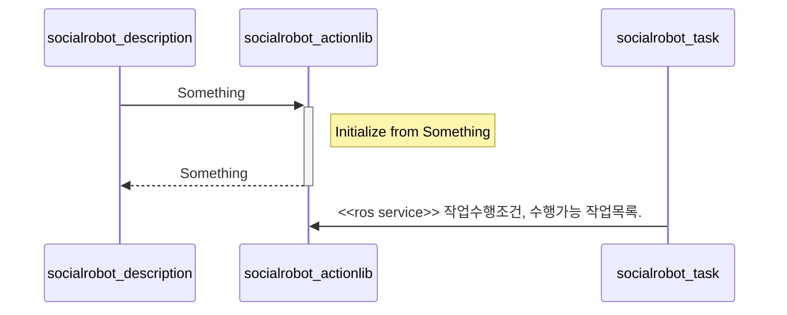

# Socialrobot_perception

- Version 1.0.0
- [[Go to the Social Robot Project Main]](https://gitlab.com/social-robot/socialrobot)

---

**Table of Contents**
1. [Overview](#overview)
2. [Installation methods](#installation-methods)
   1. [Install manually](#install-manually)
3. [Dependencies](#dependencies)
   1. [Frameworks](#frameworks)
   2. [Third-party libraries](#third-party-libraries)
   3. [Social Robot Project Modules](#social-robot-project-modules)
4. [Features](#features)
   1. [(rostopic::publish)](#rostopicpublish)
   2. [(rosservice::response)](#rosserviceresponse)

## Overview
The metapackage for socialrobot.
- a
- a
- a


<!-- loop Initialization
    socialrobot_description-- >socialrobot_actionlib: Fight against hypochondria
end -->

example (추후 수정)



## Installation methods

<!-- ### Install using the convenience script

```sh
some code
```

### Install using the Docker images -->

### Install manually

<details><summary>CLICK HERE</summary>
<p>


</p>
</details>

## Dependencies

### Frameworks

- a

### Third-party libraries

- [a]()
  

### Social Robot Project Modules

- a

## Features

(Dependencies의 social-modules는 없으면 작동조차 안하는 것들이고,
여기 Features에 있는 social-modules는 그냥 같이 쓰이는 것들임)

Compatibility

- a
- a

### (rostopic::publish)

### (rosservice::response)

- Input
  - a
  - a
- Output
  - a
  - a
  - a


---

[[Go to the Social Robot Project Main]](https://gitlab.com/social-robot/socialrobot)
