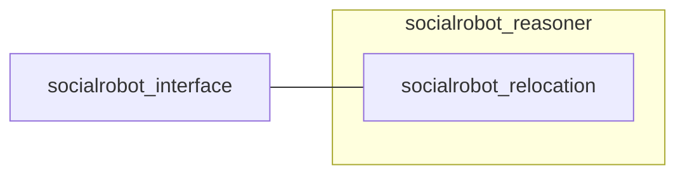

# Social Robot Metric Reasoner

<!-- Variables -->
[SRP_main]: https://gitlab.com/social-robot/socialrobot

- Version 1.0.0
- [[Go to the Social Robot Project Main]][SRP_main]

---

**Package summary**

The meta-package of metric reasoner for the social robot project.

- Maintainer status: maintained
- Maintainers
  - Jeongmin Jeon (nicky707@daum.net)
  - Hong-ryul Jung (jung.hr.1206@gmail.com)
  - Hyungpil Moon (hyungpil@skku.edu)
- Author
  - Jeongmin Jeon (nicky707@daum.net)
- Source: git https://gitlab.com/social-robot/socialrobot_reasoner.git

**Table of Contents**
- [Social Robot Metric Reasoner](#social-robot-metric-reasoner)
  - [Overview](#overview)
  - [Contents](#contents)

## Overview

The meta-package of metric reasoner for the social robot project.

## Contents

- [rearrange_node](https://gitlab.com/social-robot/socialrobot_reasoner/-/tree/master/rearrange_node)
  - Services
    - ~/rearrange_srv (rearrange_node/rearrange_env_srv.srv)
- [relocation_node](https://gitlab.com/social-robot/socialrobot_reasoner/-/tree/master/relocation_node)
  - Services
    - ~/relocation_srv (relocation_node/relocate_env_srv.srv)

---

- [[Go to the Social Robot Project Main]][SRP_main]