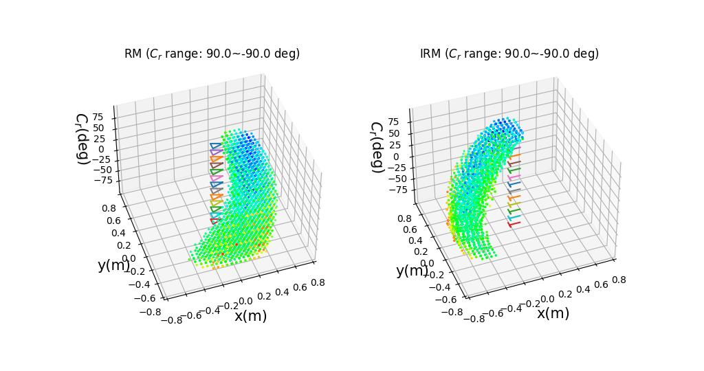

# Raw Sample Data: RM

### NPY Description

본 패키지에서 사용되는 Reachability Map의 형식은 다음과 같다.
Columns

- TCP: Tool Center Point
- EEP: End-effector Point

| Column Index | Name              | Unit       | Remark           |
| ------------ | ----------------- | ---------- | ---------------- |
| 0            | TCP x             | meter      | For query output |
| 1            | TCP y             | meter      | For query output |
| 2            | TCP z             | meter      | For query input  |
| 3            | EEP x             | meter      | For IK solver    |
| 4            | EEP y             | meter      | For IK solver    |
| 5            | EEP z             | meter      | For IK solver    |
| 6            | EE Roll           | **DEGREE** |                  |
| 7            | EE Pitch          | **DEGREE** |                  |
| 8            | EE Yaw            | **DEGREE** | Cr               |
| 9            | Manipulability    | -          |                  |
| 10           | Joint_0 value     | radian     |                  |
| 11           | Joint_1 value     | radian     |                  |
| >=12         | Joint_2... values | radian     |                  |

### (CSV Sample) Robocare Right Arm

- File: [robocare_right_reachability_map.csv](robocare_right_reachability_map.csv)
  - This CSV file has 7899 points.
  - The first row is the title.
- Columns:
  - `L =R` [idx: 00] TCP x
  - `L!=R` [idx: 01] TCP y
  - `L =R` [idx: 02] TCP z of {0.7, 0.75, 0.8}
  - `L =R` [idx: 03] eef x
  - `L!=R` [idx: 04] eef y
  - `L =R` [idx: 05] eef z
  - `L!=R` **[idx: 06] Cr(rzyz)** ← CAUTION
  - `L =R` **[idx: 07] Pitch(rzyz)** ← CAUTION
  - `L =R` **[idx: 08] Roll(rzyz)** ← CAUTION
  - `L =R` [idx: 09] Manipulability
  - `L!=R` [idx: 10] Joint_0 value: "Waist_Roll"
  - `L =R` [idx: 11] Joint_1 value: "Waist_Pitch"
  - `L =R` [idx: 12] Joint_2 value: "RShoulder_Pitch"
  - `L!=R` [idx: 13] Joint_3 value: "RShoulder_Roll"
  - `L =R` [idx: 14] Joint_4 value: "RElbow_Pitch"
  - `L!=R` [idx: 15] Joint_5 value: "RElbow_Yaw"
  - `L =R` [idx: 16] Joint_6 value: "RWrist_Pitch"
  - `L!=R` [idx: 17] Joint_7 value: "RWrist_Roll"

<!--
(2) Raw NPY file

원래는
[rad]**angle** = Cr (idx: 0)
[m] **X** (idx: 1)
[m] **Y** (idx: 2)
. **manipulability** (idx: 3) -->

<!-- - index
  - [0] [rad] yaw(Cr) -> gripper orientation (정수여야 filter칠 수 있음)
  - [1] [rad] pitch -> gripper orientation
  - [2] [rad] roll -> gripper orientation
  - [3] tcp x --(transformed)-> mobile base x
  - [4] tcp y --(transformed)-> mobile base y
  - [5] tcp z -> target object z
  - [6] manipulability -->
