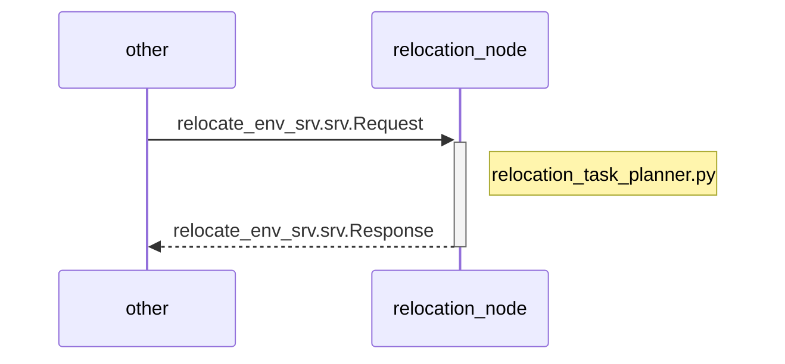
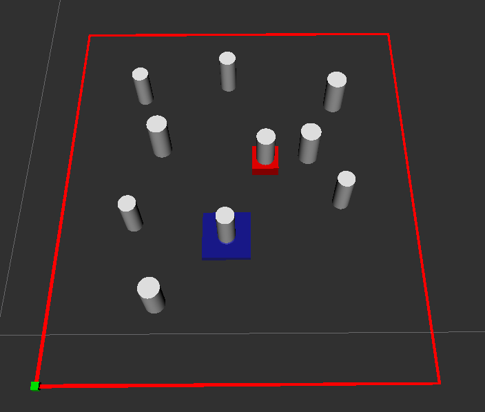

# Relocation node

<!-- Variables -->
[SRP_main]: https://gitlab.com/Jinhwi/socialrobot_relocation

* Version 1.0.0
* [[Go to the Social Robot Project Main]][SRP_main]

---

<div style="display:flex; ">
<div style="flex:50%; padding-right:10px; border-right: 1px solid #dcdde1">

**Package summary**

This package determines the object to be relocated in order to clear all obstacles that prevent grasping a target object in clutter. It can be used for three cases varying depending on the degree of uncertainty in object recognition: 1) all objects are detected, 2) the target object is detected but some other objects are not, and 3) some objects including the target object are undetected.

* Maintainer status: maintained
* Maintainers
  + Jinhwi Lee (jinhooi@kist.re.kr)
  + Sang Hun Cheong (welovehun@kist.re.kr)
  + Changjoo Nam (cjnam@kist.re.kr)
* Author
  + Changjoo Nam (cjnam@kist.re.kr)
* License: {License Name}
* Source: git https://{Git URL}.git

</div>
<div style="flex:40%; padding-left:10px; ">

**Table of Contents**

1. [Overview](#overview)
2. [Installation methods](#installation-methods)
   1. [Install using the convenience script](#install-using-the-convenience-script)
3. [Dependencies](#dependencies)
   1. [Frameworks](#frameworks)
   2. [Social Robot Project Modules](#social-robot-project-modules)
   3. [Hardware requirements](#hardware-requirements)
4. [Quick start](#quick-start)
   1. [Example](#example)
   2. [test_module.py](#test_modulepy)
5. [Services](#services)

</div>
</div>

---

## Overview

This package determines the object to be relocated in order to clear all obstacles that prevent grasping a target object in clutter. It works for the cases where
i) all objects are known, 
ii) some objects including the target are unknown, and
iii) some objects including the target are unknown. The input is the 2D coordinates of all known movable objects and immovable objects (e.g., walls).
Before every relocation action of the robot, this information is obtained from the service node system_manager. The package finds the object to be relocated. The information of the object (ID and 2D coordinates) is sent to the client node system_manager.



## Installation methods

### Install using the convenience script

Install the package through catkin build system. relocate_env_srv.srv

## Dependencies

### Frameworks

* ROS Kinetic/Melodic
  + ROS Moveit!

### Social Robot Project Modules

- socialrobot_perception

### Hardware requirements

The package does not require any hardware device.

## Quick start 

1. Install the package through catkin build system. `relocate_env_srv.srv`

```
float64 robot_height
float64[] robot_pose
int64 target_id
int64 N
float64[] R
float64[] H
float64[] X
float64[] Y
float64 x_min
float64 x_max
float64 y_min
float64 y_max
int64 accessibility
int64 relocate_id
float64[] relocate_coordinates
```

### Example

```py
# input (10 objects, target ID = 8)
robot_height = 0.075
robot_pose = [0.32299999999999995, -0.06575]
target_id = 8
N = 10
R = [0.025, 0.026, 0.03, 0.028, 0.026, 0.025, 0.03, 0.03, 0.029, 0.025, 0.03]
H = [0.073, 0.071, 0.068, 0.07, 0.071, 0.069, 0.07, 0.073, 0.066, 0.066, 0.075]
X = [0.475, 0.306, 0.475, 0.36405000000000004, 0.306, 0.17099999999999999, 0.43005000000000004, 0.20405, 0.20900000000000002, 0.17099999999999999]
Y = [0.19475, 0.14075000000000001, 0.36975, 0.26625, 0.40975000000000006, 0.16075, 0.27425, 0.28725, 0.04225, 0.38375000000000004]
x_min =0.06299999999999999
x_max =0.583
y_min =-0.06575
y_max =0.51775
```

```py
# Example run
import rospy
from relocate_planner.srv._relocate_env_srv import *
rospy.wait_for_service('relocate_srv')
reloc_srv = rospy. ServiceProxy('relocate_srv', relocate_env_srv)
pub_msg = relocate_env_srvRequest()
pub_msg.robot_height = robot_height
pub_msg.robot_pose = robot_pose
pub_msg.target_id = target_id
pub_msg. N = N
pub_msg. R = R
pub_msg. H = H
pub_msg. X = X
pub_msg. Y = Y
pub_msg.x_min = x_min
pub_msg.x_max = x_max
pub_msg.y_min = y_min
pub_msg.y_max = y_max
ret = reloc_srv(pub_msg)
accessibility = ret.accessibility
relocate_id= ret.relocate_id
relocate_coordinates = ret.relocate_coordinates
print('Target accessibility (-1=unaccessible, 0=undetected, 1=accessible): %d' % accessibility)print('Relocate Object %d at (%f, %f)' % (relocate_id, relocate_coordinates[0], relocate_coordinates[1]))
```

### test_module.py

When the `target_id` of the request is **3 (red cuboid)** from above example, the `relocate_id` of the output is **1 (blue cuboid)** and the `accessibility` will be `-1(unaccessible)`. Since the gripper cannot reach to 3 directly.



## Services

* {Service Name} (pkg_name/relocate_env_srv.srv)

<div style="display:flex; padding-left:50px">
<div style="flex:50%; padding-right:10px; border-right: 1px solid #dcdde1">

Request

* ~/robot_height ( `float64` )
  + the height of robot view point (i.e., camera's z coordinate)
* ~/robot_pose ( `float64[]` )
  + the 2D coordinates of the robot (and the camera)
* ~/target_id ( `int64` )
  + ID of the target object (-9999 if unknown)
* ~/N ( `int64` )
  + the number of all objects including the target
* ~/R ( `float64[]` )
  + the radii of objects in meters
* ~/H ( `float64[]` )
  + the heights of objects in meters
* ~/X ( `float64[]` )
  + the x coordinates of objects in meters
* ~/Y ( `float64[]` )
  + the y coordinates of objects in meters
* ~/x_min ( `float64` )
  + the minimum x coordinate of the environment
* ~/x_max ( `float64` )
  + the maximum x coordinate of the environment
* ~/y_min ( `float64` )
  + the minimum y coordinate of the environment
* ~/y_max ( `float64` )
  + the maximum y coordinate of the environment

</div>
<div style="flex:50%; padding-left:10px; ">

Response

* ~/accessibility ( `int64` )
  + the accessibility of the target object (-1=unaccessible, 0=undetected, 1=accessible)
* ~/relocate_id ( `int64` )
  + the ID of the object to be relocated
* ~/relocate_coordinates ( `float64[]` )
  + the (x, y) coordinates of the object to be relocated

</div>
</div>

---

* [[Go to the Social Robot Project Main]][SRP_main]
