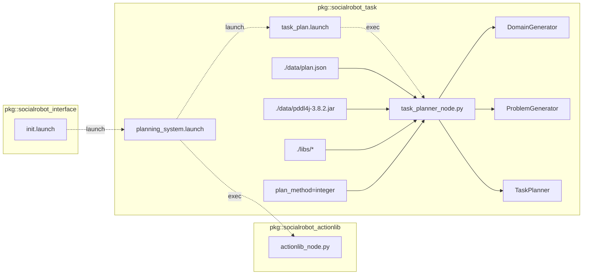

# Social Robot Task manager

<!-- Variables -->
[SRP_main]: https://gitlab.com/social-robot/socialrobot

- Version 1.0.0
- [[Go to the Social Robot Project Main]][SRP_main]

---

<div style="display:flex;">
<div style="flex:50%; padding-right:10px; border-right: 1px solid #dcdde1">

**Package summary**

PDDL based task planner package for social robot

- Maintainer status: maintained
- Maintainers
  - Jeongmin Jeon (nicky707@daum.net)
  - Hong-ryul Jung (jung.hr.1206@gmail.com)
  - Hyungpil Moon (hyungpil@skku.edu)
- Author
  - Jeongmin Jeon (nicky707@daum.net)
- License: {License Name}
- Source: git https://gitlab.com/social-robot/socialrobot_task.git

</div>
<div style="flex:40%; padding-left:10px;">

**Table of Contents**
1. [Overview](#overview)
2. [Installation methods](#installation-methods)
   1. [Install using the Docker images](#install-using-the-docker-images)
   2. [Install manually](#install-manually)
3. [Dependencies](#dependencies)
   1. [Frameworks](#frameworks)
   2. [Third-party libraries](#third-party-libraries)
   3. [Social Robot Project Modules](#social-robot-project-modules)
   4. [Hardware requirements](#hardware-requirements)
4. [Quick start](#quick-start)
5. [Features](#features)
   1. [Example](#example)
6. [Nodes](#nodes)
   1. [{Node1 Name}](#node1-name)

</div>
</div>

---

## Overview

PDDL based task planner package

planning_system.launch:



## Installation methods

### Install using the Docker images

.

### Install manually

1. Install the ROS. [Instructions for Ubuntu 16.04](http://wiki.ros.org/indigo/Installation/Ubuntu)
   
2. [Setup your ROS environment](http://wiki.ros.org/ROS/Tutorials/InstallingandConfiguringROSEnvironment)

3. To run the Fast-Downward planner, download ant compile the source.
   ```   
   hg clone http://hg.fast-downward.org DIRNAME
   ```
   will create a clone of the Fast Downward master repository in directory DIRNAME. 

   To build the planner for the first time, run:
   ```
   cd DIRNAME
   ./build.py
   ```

4. copy the executable planner into ROS package
   ```
   cp -rf builds/release/bin/downward {DIR_SOCIALROBOT_TASK}/libs/fast-downward/bin
   ```
   The variable ```DIR_SOCIALROBOT_TASK``` is path of socialrobot_task package.

## Dependencies

### Frameworks

- ROS Kinetic/Melodic

### Third-party libraries

- [pddl4j](https://github.com/pellierd/pddl4j)
- openjdk-8-jdk
- [fast-downward](http://hg.fast-downward.org/)

### Social Robot Project Modules

- socialrobot_actionlib
- socialrobot_task_msgs

### Hardware requirements

This package does not require any hardware device.

## Quick start 

```sh
roslaunch socialrobot_task planning_system.launch
```

## Features

Lorem ipsum dolor sit amet, consectetur adipisicing elit, sed do eiusmod tempor incididunt ut labore et dolore magna aliqua. Ut enim ad minim veniam, quis nostrud exercitation ullamco laboris nisi ut aliquip ex ea commodo consequat. Duis aute irure dolor in reprehenderit in voluptate velit esse cillum dolore eu fugiat nulla pariatur. Excepteur sint occaecat cupidatat non proident, sunt in culpa qui officia deserunt mollit anim id est laborum.

### Example

Lorem ipsum dolor sit amet, consectetur adipisicing elit, sed do eiusmod tempor incididunt ut labore et dolore magna aliqua. Ut enim ad minim veniam, quis nostrud exercitation ullamco laboris nisi ut aliquip ex ea commodo consequat. Duis aute irure dolor in reprehenderit in voluptate velit esse cillum dolore eu fugiat nulla pariatur. Excepteur sint occaecat cupidatat non proident, sunt in culpa qui officia deserunt mollit anim id est laborum.

## Nodes

### {Node1 Name}

<div style="padding-left:40px;">

#### Subscribed Topics

- ~<some_name>/<topic_name> ([geometry_msgs/Point](http://docs.ros.org/api/geometry_msgs/html/msg/Point.html))
  - Lorem ipsum dolor sit amet, consectetur adipisicing elit, sed do eiusmod tempor incididunt ut labore et dolore magna aliqua.
- ~<some_name>/<topic_name> ([geometry_msgs/Point](http://docs.ros.org/api/geometry_msgs/html/msg/Point.html))
  - Lorem ipsum dolor sit amet, consectetur adipisicing elit, sed do eiusmod tempor incididunt ut labore et dolore magna aliqua.

#### Published Topics

- ~<some_name>/<topic_name> ([geometry_msgs/Point](http://docs.ros.org/api/geometry_msgs/html/msg/Point.html))
  - Lorem ipsum dolor sit amet, consectetur adipisicing elit, sed do eiusmod tempor incididunt ut labore et dolore magna aliqua.

#### Messages

- {message_name}.msg
  - header (`Header`)
    - Standard metadata for higher-level stamped data types.
  - paramA (`type`)
    - Lorem ipsum dolor sit amet, consectetur adipisicing elit, sed do eiusmod tempor incididunt ut labore et dolore magna aliqua.
  - paramB (`type`)
    - Lorem ipsum dolor sit amet, consectetur adipisicing elit, sed do eiusmod tempor incididunt ut labore et dolore magna aliqua.

#### Services

- {Service Name} (pkg_name/srv_file.srv)
  - Lorem ipsum dolor sit amet, consectetur adipisicing elit, sed do eiusmod tempor incididunt ut labore et dolore magna aliqua.

<div style="display:flex; padding-left:50px">
<div style="flex:50%; padding-right:10px; border-right: 1px solid #dcdde1">

Request

- InputParamX (`float64[]`)
  - Lorem ipsum dolor sit amet, consectetur adipisicing elit, sed do eiusmod tempor incididunt ut labore et dolore magna aliqua.
- InputParamY (`float64[]`)
  - Lorem ipsum dolor sit amet, consectetur adipisicing elit, sed do eiusmod tempor incididunt ut labore et dolore magna aliqua.

</div>
<div style="flex:50%; padding-left:10px;">

Response

- OutputParam1 (`int64`)
  - Lorem ipsum dolor sit amet, consectetur adipisicing elit, sed do eiusmod tempor incididunt ut labore et dolore magna aliqua.
- OutputParam2 (`int64[]`)
  - Lorem ipsum dolor sit amet, consectetur adipisicing elit, sed do eiusmod tempor incididunt ut labore et dolore magna aliqua.

</div>
</div>

#### Services Called

- ~<some_name>/<service_name> ([nav_msgs/GetMap](http://docs.ros.org/api/nav_msgs/html/srv/GetMap.html))
  - This node calls this service to do {something}.

#### Parameters

- ~parameter_name (int, default: 100)
  - Lorem ipsum dolor sit amet, consectetur adipisicing elit, sed do eiusmod tempor incididunt ut labore et dolore magna aliqua.
- ~parameter_name (int, default: 100)
  - Lorem ipsum dolor sit amet, consectetur adipisicing elit, sed do eiusmod tempor incididunt ut labore et dolore magna aliqua.

</div>

---

- [[Go to the Social Robot Project Main]][SRP_main]
