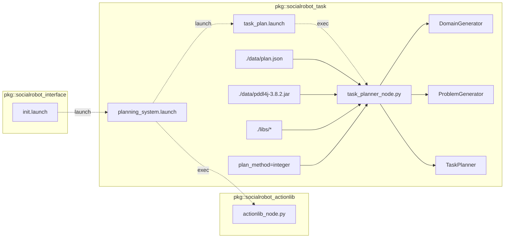

# Social Robot Task manager

<!-- Variables -->
[SRP_main]: https://gitlab.com/social-robot/socialrobot

- Version 1.0.0
- [[Go to the Social Robot Project Main]][SRP_main]

---

<div style="display:flex;">
<div style="flex:50%; padding-right:10px; border-right: 1px solid #dcdde1">

**Package summary**

PDDL based task planner package for social robot

- Maintainer status: maintained
- Maintainers
  - Jeongmin Jeon (nicky707@daum.net)
  - Hong-ryul Jung (jung.hr.1206@gmail.com)
  - Hyungpil Moon (hyungpil@skku.edu)
- Author
  - Jeongmin Jeon (nicky707@daum.net)
- License: {License Name}
- Source: git https://gitlab.com/social-robot/socialrobot_task.git

</div>
<div style="flex:40%; padding-left:10px;">

**Table of Contents**
- [Social Robot Task manager](#social-robot-task-manager)
  - [Overview](#overview)
  - [Installation methods](#installation-methods)
    - [Install manually](#install-manually)
  - [Dependencies](#dependencies)
    - [Frameworks](#frameworks)
    - [Third-party libraries](#third-party-libraries)
    - [Social Robot Project Modules](#social-robot-project-modules)
    - [Hardware requirements](#hardware-requirements)
  - [Quick start](#quick-start)
  - [Nodes](#nodes)
    - [task_manager](#task_manager)
      - [Services](#services)
    - [Task planning Example](#task-planning-example)

</div>
</div>

---

## Overview

PDDL based task planner package

planning_system.launch:



## Installation methods

### Install manually

1. Install the ROS. [Instructions for Ubuntu 16.04](http://wiki.ros.org/indigo/Installation/Ubuntu)
   
2. [Setup your ROS environment](http://wiki.ros.org/ROS/Tutorials/InstallingandConfiguringROSEnvironment)

3. To run the Fast-Downward planner, download ant compile the source.
   ```   
   hg clone http://hg.fast-downward.org DIRNAME
   ```
   will create a clone of the Fast Downward master repository in directory DIRNAME. 

   To build the planner for the first time, run:
   ```
   cd DIRNAME
   ./build.py
   ```

4. copy the executable planner into ROS package
   ```
   cp -rf builds/release/bin/downward {DIR_SOCIALROBOT_TASK}/libs/fast-downward/bin
   ```
   The variable ```DIR_SOCIALROBOT_TASK``` is path of socialrobot_task package.

## Dependencies

### Frameworks

- ROS Kinetic/Melodic

### Third-party libraries

- [pddl4j](https://github.com/pellierd/pddl4j)
- openjdk-8-jdk
- [fast-downward](http://hg.fast-downward.org/)

### Social Robot Project Modules

- [socialrobot_actionlib](./socialrobot_actionlib/)

### Hardware requirements

This package does not require any hardware device.

## Quick start 

```sh
roslaunch socialrobot_task planning_system.launch
```

## Nodes

### task_manager

<div style="padding-left:40px;">
</div>

#### Services

- /task_plan/get_action_sequence ([socialrobot_task/GetActionSeq](./srv/GetActionSeq.srv))
  - request action sequence as a result of task planning

<div style="display:flex; padding-left:50px">
<div style="flex:50%; padding-right:10px; border-right: 1px solid #dcdde1">

Request

- query (`string`)
  - empty query
</div>
<div style="flex:50%; padding-left:10px;">

Response

- header (`std_msgs/Header`)
  - header of action sequence
- plan_result (`int32`)
  - SUCCESS = 1
  - FAIL = 0
- action_sequence (`socialrobot_actionlib/Action[]`)
  - compound action sequence

</div>
</div>

- /task_plan/set_problem ([socialrobot_task/SetProblem](./srv/SetProblem.srv))
  - request action sequence as a result of task planning

<div style="display:flex; padding-left:50px">
<div style="flex:50%; padding-right:10px; border-right: 1px solid #dcdde1">

Request

- problem (`socialrobot_actionlib/Problem`)
  - setup task domain before task planning
</div>
<div style="flex:50%; padding-left:10px;">

Response

- result (`bool`)
  - result of task planning

</div>
</div>

### Task planning Example

1. launch task planning and action library modules
   ```sh
   roslaunch socialrobot_task planning_system.launch
   ```
2. request task planning to planner node
   ```sh
   rosrun socialrobot_task testGetActionSeq.py
   ```  

---

- [[Go to the Social Robot Project Main]][SRP_main]
